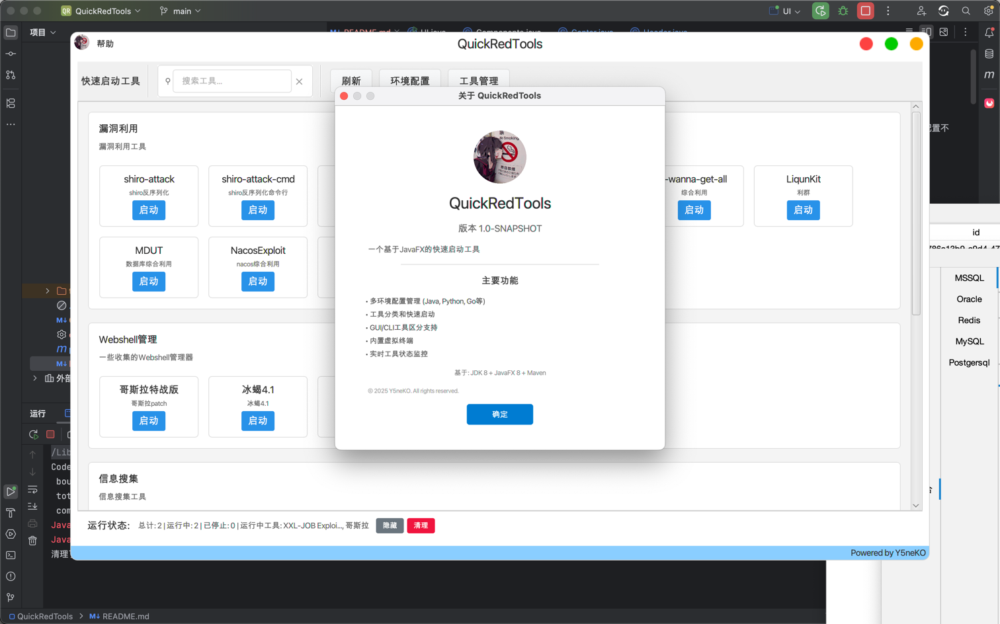

# QuickRedTools 使用说明

## 项目概述

QuickRedTools 是一个基于JavaFX开发的快速启动工具，允许用户配置不同的开发环境（Java、Python、Go等）并快速启动各种工具。



## 功能特性

- **环境管理**：支持配置多种开发环境，包括Java、Python、Go、Gem、Node.js等
- **工具分类**：可以创建不同的工具分类，便于管理各种工具
- **快速启动**：一键启动配置好的工具，支持自定义启动参数和工作目录
- **数据持久化**：配置数据保存在JSON文件中，重启后数据不丢失
- **跨平台**：基于Java开发，支持Windows、macOS、Linux

## 运行方法

### 前提条件

1. JDK 8 或更高版本
2. JavaFX运行环境

### 启动应用

```bash
# 方法1：使用Maven运行
mvn javafx:run

# 方法2：打包后运行JAR
mvn clean package
java -jar target/Y5Sec_UI_Template_via_JavaFx-1.0-SNAPSHOT.jar
```

## 使用指南

### 1. 环境配置

1. 点击主界面的"环境配置"按钮
2. 在环境配置窗口中，可以：
   - **添加环境**：配置新的开发环境
   - **编辑环境**：修改现有环境配置
   - **删除环境**：删除不需要的环境
3. 环境配置包括：
   - ID：唯一标识符
   - 名称：环境显示名称
   - 类型：环境类型（Java、Python、Go等）
   - 可执行文件路径：对应环境的主程序路径
   - 启动参数：环境级别的启动参数
   - 描述：环境说明

### 2. 工具分类管理

1. 点击主界面的"工具管理"按钮
2. 在工具管理窗口中，选择"工具分类管理"标签页
3. 可以：
   - **添加分类**：创建新的工具分类
   - **编辑分类**：修改分类信息
   - **删除分类**：删除分类（注意：不会删除分类下的工具）

### 3. 工具管理

1. 在工具管理窗口中，选择"工具管理"标签页
2. 可以：
   - **添加工具**：配置新的工具
   - **编辑工具**：修改工具配置
   - **删除工具**：删除工具
   - **测试启动**：测试工具是否能正常启动
3. 工具配置包括：
   - ID：唯一标识符
   - 工具名称：工具显示名称
   - 描述：工具说明
   - 环境：工具使用的运行环境
   - 命令：工具的执行命令或脚本路径
   - 参数：工具的启动参数
   - 工作目录：工具运行的工作目录

### 4. 启动工具

1. 在主界面中，工具会按分类显示
2. 点击工具卡片上的"启动"按钮即可启动工具
3. 启动后会显示成功消息和进程ID
4. 程序会监控工具运行状态，结束后会显示退出码

## 配置示例

### Java环境配置示例

```
ID: java-11
名称: Java 11
类型: java
可执行文件路径: /usr/lib/jvm/java-11-openjdk/bin/java
启动参数: -Xms512m -Xmx1024m
描述: OpenJDK 11 环境
```

### Maven工具配置示例

```
ID: maven-tool
工具名称: Maven
描述: Apache Maven 构建工具
环境: java-11
命令: /usr/local/bin/mvn
参数: clean compile
工作目录: /path/to/project
```

### Python工具配置示例

```
ID: python-script
工具名称: 数据分析脚本
描述: Python数据分析脚本
环境: python-default
命令: python
参数: analyze.py
工作目录: /path/to/project
```

## 数据存储

配置数据保存在项目目录下的 `data` 文件夹中：
- `environments.json`：环境配置
- `categories.json`：工具分类
- `tools.json`：工具配置

## 注意事项

1. 确保配置的可执行文件路径正确且具有执行权限
2. 工作目录路径必须是存在的目录
3. 启动参数格式要正确，多个参数用空格分隔
4. 删除环境前请确保没有工具在使用该环境
5. 建议定期备份 `data` 文件夹

## 故障排除

### 无法启动工具

1. 检查环境配置中的可执行文件路径是否正确
2. 确认文件具有执行权限
3. 检查工具命令路径是否存在
4. 查看控制台输出的错误信息

### 配置丢失

1. 检查 `data` 文件夹是否存在
2. 确认程序有读写 `data` 文件夹的权限
3. 从备份恢复JSON配置文件

### 界面显示异常

1. 确保JavaFX运行环境正确安装
2. 检查JDK版本兼容性
3. 重新打包应用程序

## 使用许可

本项目基于 MIT 协议开源